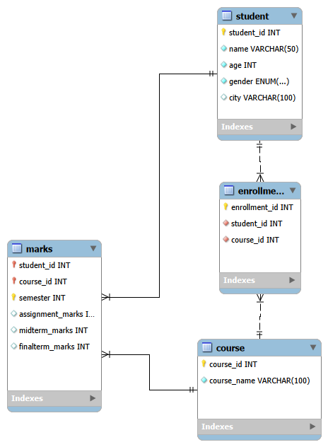

# 🎓 Student Management System (Python + MySQL)

A simple, easy-to-run Student Management System with both a console interface and a Tkinter GUI. Built with Python and MySQL to demonstrate database connectivity, CRUD operations, SQL joins, and basic GUI design.

[](LICENSE) [](https://www.python.org/) []()


---

## Table of Contents

- [About](#about)
- [Features](#features)
- [Tech Stack](#tech-stack)
- [Project Structure](#project-structure)
- [ER Diagram](#-er-diagram)
- [Screenshots](#screenshots)
- [Prerequisites](#prerequisites)
- [Setup & Installation](#setup--installation)
- [Database Setup](#database-setup)
- [Run the Project](#run-the-project)
- [Sample Queries](#sample-queries)
- [Troubleshooting](#troubleshooting)
- [Future Improvements](#future-improvements)
- [Contributing](#contributing)
- [Author](#author)

---

## About

This repository contains a Student Management System with two interfaces:

- Console (menu-driven) version for quick CLI usage.
- GUI version implemented with Tkinter for an interactive experience.

Use it to learn how Python connects to MySQL, how to structure simple CRUD applications, and how to build a basic GUI for database-driven apps.

---

## Features

- View, add, update, and delete student records
- View courses and enroll students
- Student course reports and marks
- Search students by ID/name (search-by-name planned)
- Console and GUI interfaces
- Sample data generation included in the SQL setup

---

## Tech Stack

- Python 3.10+ (tested on 3.13)
- MySQL 8.x
- mysql-connector-python
- Tkinter (for GUI)
- VS Code for development

---

## Project Structure

```
Student-Management-System/
├── SQL/
│   ├── student_management_setup.sql
│   ├── queries.sql
│   └── ER_Diagram.png
├── Console_Version/
│   ├── main.py
│   └── Images/Console_Menu.png
├── GUI_Version/
│   ├── main.py
│   └── Images/
├── Images/
│   ├── Menu.png
│   ├── GUI_Home.png
│   ├── GUI_Add_Student.png
│   ├── GUI_Update_Student.png
│   ├── GUI_Delete_Student.png
│   └── GUI_Report.png
├── requirements.txt
├── README.md
└── LICENSE
```

---

# 📊 ER Diagram




---

## Screenshots

Console Menu


GUI Home


Add Student


Update Student


Delete Student


Student Course Report


---

## Prerequisites

- Python 3.10 or newer (3.13 tested)
- MySQL server (8.x recommended)
- git

---

## Setup & Installation

1. Clone the repository

```bash
git clone https://github.com/anujbhatt30/Student-Management-System.git
cd Student-Management-System
```

2. Create and activate a virtual environment

Linux / macOS

```bash
python3 -m venv venv
source venv/bin/activate
```

Windows (PowerShell)

```powershell
python -m venv venv
.\venv\Scripts\Activate.ps1
```

3. Install dependencies

```bash
pip install -r requirements.txt
```

---

## Database Setup

Create the database and sample data using the provided SQL file.

Using MySQL CLI

```bash
mysql -u <your_db_user> -p < SQL/student_management_setup.sql
```

Or open `SQL/student_management_setup.sql` in MySQL Workbench and run the script.

The SQL script creates:
- Database `student_management` (or the configured name inside the script)
- Tables: Students, Courses, Enrollment, Marks
- Sample data for testing

### Database credentials / configuration

To avoid hard-coding credentials, create a `.env` file at the project root (this repo does not currently include one):

```
DB_HOST=localhost
DB_PORT=3306
DB_USER=root
DB_PASS=your_password
DB_NAME=student_management
```

Update the database connection code (Console_Version/main.py and GUI_Version/main.py) to read these environment variables or pass credentials directly for testing.

---

## Run the Project

Console version

```bash
python Console_Version/main.py
```

GUI version

```bash
python GUI_Version/main.py
```

---

## Sample Queries

```sql
-- Get all marks for a student across enrolled courses
SELECT s.name, c.course_name, m.marks
FROM Students s
JOIN Enrollment e ON s.student_id = e.student_id
JOIN Courses c ON e.course_id = c.course_id
JOIN Marks m ON m.enrollment_id = e.enrollment_id
WHERE s.student_id = 1;

-- Count of students enrolled per course
SELECT c.course_name, COUNT(e.student_id) AS total_students
FROM Courses c
LEFT JOIN Enrollment e ON c.course_id = e.course_id
GROUP BY c.course_name;
```
---

## Future Improvements (Ideas)

- User authentication for admin access
- Password hashing & encryption
- Attendance management
- Student performance dashboard and charts
- Export reports to Excel / PDF
- REST API layer
- Add unit tests and CI

---

## Contributing

Contributions are welcome! Feel free to open issues or submit pull requests. For major changes, please open an issue first to discuss what you would like to change.

---

## Author

**Anuj Bhatt**

---

