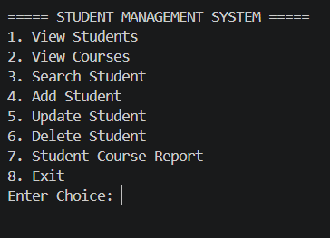
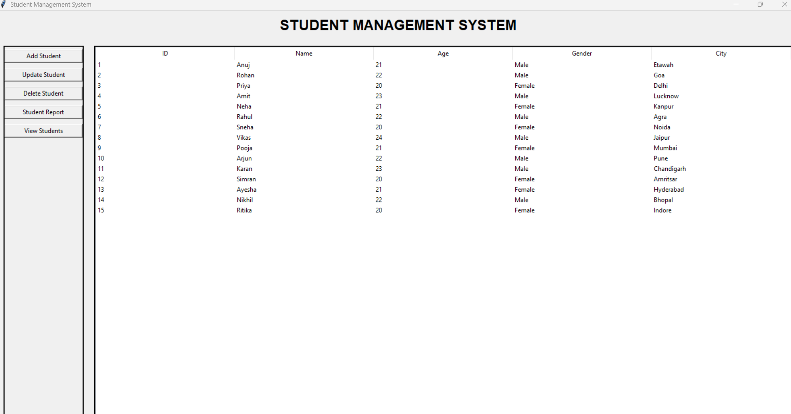
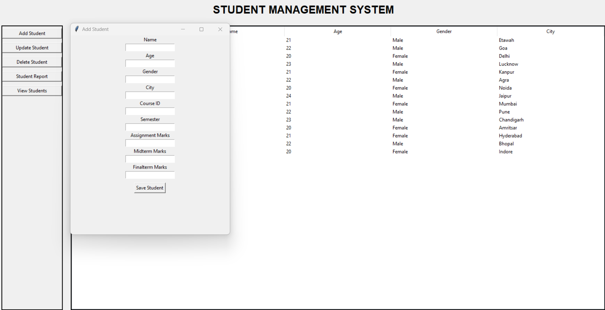
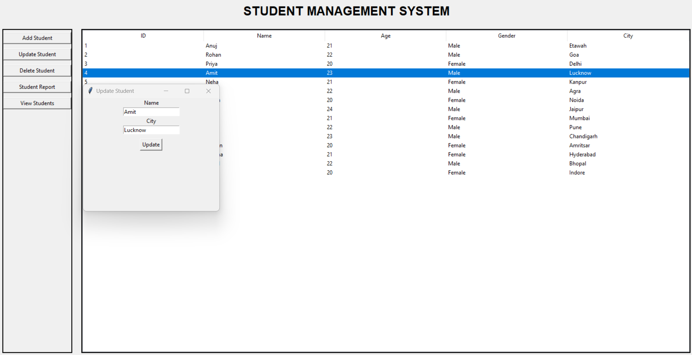
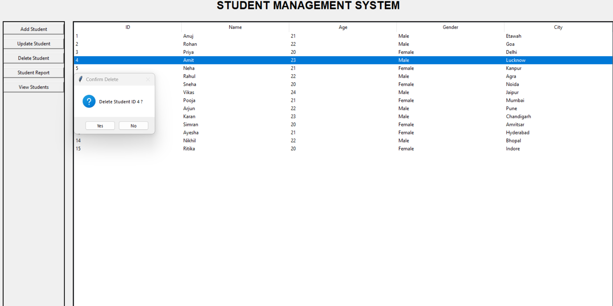
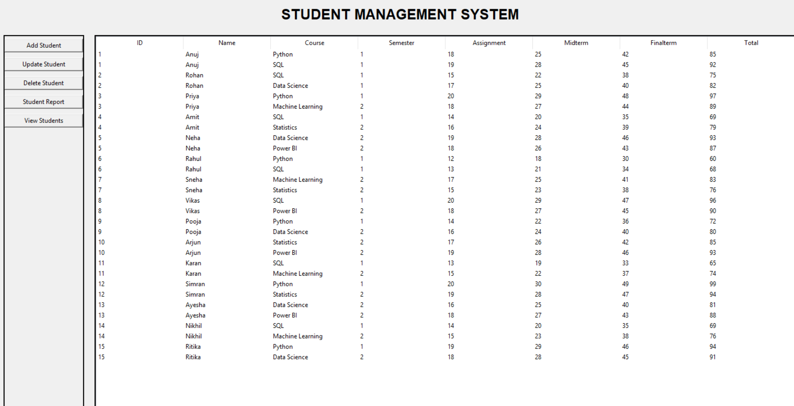

# 🎓 Student Management System (Python + MySQL)

A complete **Student Management System** developed using **Python** and **MySQL** that demonstrates database connectivity, CRUD operations, SQL joins, and a user-friendly interface.

This project includes both a **Console Version** and a **GUI Version**, allowing users to manage student records efficiently.

---

# 📌 Features

## Console Version

- View Students
- View Courses
- Search Student by ID
- Add New Student
- Update Student Details
- Delete Student
- Student Course Report
- Menu Driven Interface

## GUI Version

- User-friendly Interface
- Student Management
- Course Management
- Search Records
- Add / Update / Delete Students
- Database Connectivity
- Interactive Buttons and Forms

---

# 🛠 Technologies Used

- Python 3.13
- MySQL
- MySQL Connector (mysql-connector-python)
- SQL
- Tkinter *(GUI Version)*
- VS Code
- Git & GitHub

---

# 📂 Project Structure

```
Student-Management-System/
│
├── SQL/
│   ├── student_management_setup.sql
│   ├── queries.sql
│   └── ER_Diagram.png
│
├── Console_Version/
│   └── main.py
│
├── GUI_Version/
│   └── main.py
│
├── Images/
│   ├── Menu.png
│   ├── GUI_Home.png
│   ├── Add_Student.png
│   ├── Search_Student.png
│   ├── Update_Student.png
│   ├── Delete_Student.png
│   └── Student_Report.png
│
├── requirements.txt
├── README.md
└── LICENSE
```

---

# 🗄 Database Schema

The project consists of four relational tables:

- Student
- Course
- Enrollment
- Marks

Relationships between these tables are represented in the ER Diagram.

---

# 📊 ER Diagram


---

# ⚙️ Installation

## Clone the Repository

```bash
git clone https://github.com/yourusername/student-management-system.git
```

---

## Navigate into the Project

```bash
cd student-management-system
```

---

## Install Dependencies

```bash
pip install -r requirements.txt
```

---

## Create the Database

Open MySQL Workbench and execute

```
SQL/student_management_setup.sql
```

This will create

- Database
- Tables
- Relationships
- Sample Data

---

# ▶️ Run the Project

## Console Version

```bash
python Console_Version/main.py
```

---

## GUI Version

```bash
python GUI_Version/main.py
```

---

# 💻 Console Features

- View Students
- View Courses
- Search Student
- Add Student
- Update Student
- Delete Student
- Student Course Report

---

# 🖥 GUI Features

- Student Dashboard
- Add Student Form
- Update Student Form
- Delete Student
- Search Student
- View Student Records
- Course Report

---

# 📷 Screenshots

## Console Menu



---

## GUI Home



---

## Add Student



---

## Update Student



---

## Delete Student



---

## Student Course Report



---

# 📚 SQL Concepts Used

- SELECT
- INSERT
- UPDATE
- DELETE
- INNER JOIN
- GROUP BY
- ORDER BY
- Aggregate Functions
- CASE Statement
- Parameterized Queries
- Primary Key
- Foreign Key

---

# 🐍 Python Concepts Used

- Functions
- Loops
- Conditional Statements
- MySQL Connector
- Cursor Object
- CRUD Operations
- Exception Handling
- User Input
- GUI Programming (Tkinter)

---

# 🚀 Future Improvements

- User Login Authentication
- Password Encryption
- Attendance Management
- Student Performance Dashboard
- Export Data to Excel
- PDF Report Generation
- Search by Name
- Search by City
- Data Visualization
- REST API Integration

---

# 👨‍💻 Author

**Anuj Bhatt**

---

# ⭐ If you found this project useful

Please consider giving this repository a **Star ⭐**

It helps support the project and motivates future improvements.